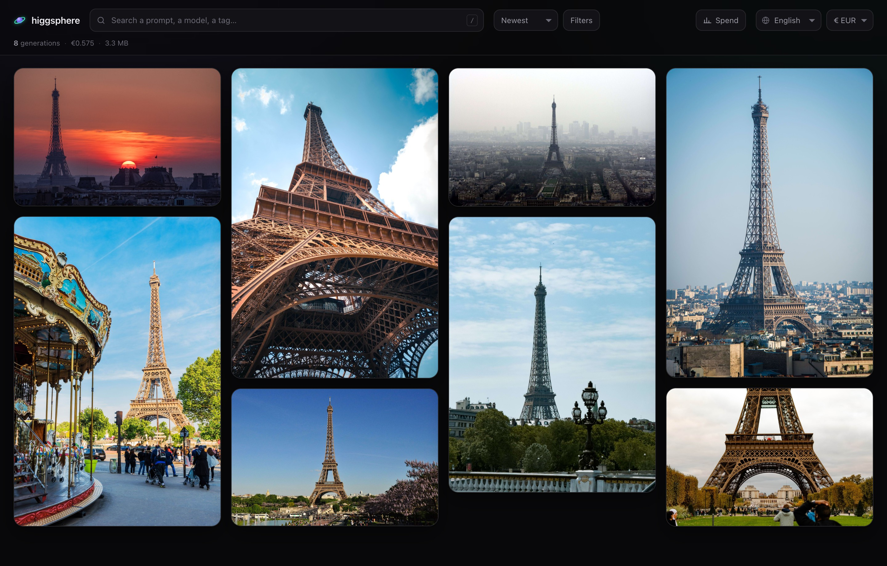
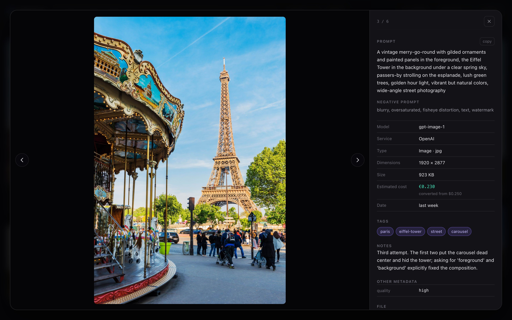
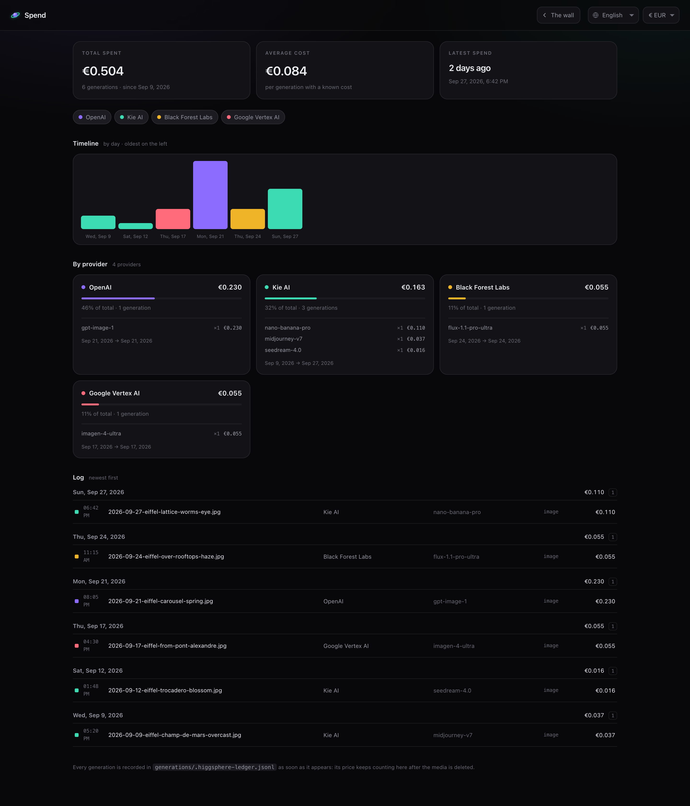

# higgsphere

**English** · [Français](README.fr.md) · [Español](README.es.md)

A local gallery for every image and video you generate with AI: newest first, each one next
to the exact prompt, model and cost that produced it. This repo comes with AI skills to
optimise the generation process.



## Why

AI media ends up scattered across provider dashboards, download folders and chat
histories, and the prompt behind a result is usually lost. higgsphere keeps everything in
one folder and shows it as a masonry wall you can search and filter.

It is also built to be driven by an LLM. Instead of writing prompts by hand, you describe
what you want to Claude Code (or another service like Claude Code). It writes a detailed prompt,
calls the model, then saves the result together with its metadata.
Because every prompt stays next to its output, you can compare results,
keep the phrasings that work, and ask the LLM to improve the next attempt from what you already have.

## Setup

Requires Node.js 20.19+ (Vite 8).

```sh
# Clone the repo first
git clone git@github.com:ThomasGysemans/higgsphere.git
npm install
npm run dev        # http://localhost:5173
```

To generate media from Claude Code, copy `.env.example` to `.env` and add your
[Kie AI](https://kie.ai) key.

## How it works

### Results folder

The `generations/` folder is the wall's only data source. Every image or video is stored
there, next to a `.json` file with the same name that records how it was made:

```
generations/
  2026-08-31-nebula-drift.png
  2026-08-31-nebula-drift.json
```

```json
{
  "prompt": "A vast nebula drifting through deep space, volumetric dust lanes lit from within",
  "model": "imagen-4-ultra",
  "service": "Google Vertex AI",
  "cost": 0.06,
  "created_at": "2026-08-31T10:31:00Z"
}
```

> The JSON files can include custom metadata that the LLM will set up on its own.

New files show up on the wall within a second, with no reload or restart. Every field is
optional, and subfolders are fine. The full schema is in [AGENTS.md](AGENTS.md), which
coding agents read automatically, so they write these files correctly without being told.



### The spend ledger

`generations/.higgsphere-ledger.jsonl` records everything you have paid for. A generation
is logged as soon as it appears in the folder, and the entry stays after the file is
deleted, whether you delete it from the app or with `rm`. Deleting a media file removes a
tile from the wall but doesn't lower the total spent. The **Spend** page (`/stats`)
reads the ledger to show spending over time, by provider and by model.

The ledger is append-only and unversioned by default.



### Currencies

Costs are stored in the currency the provider billed. The header lets you show every
amount in euros, US dollars or pounds sterling, converted with fixed rates.

## Languages

The interface is available in English, French and Spanish. Pick one in the header.
Only the interface is translated: prompts, notes, tags and everything else from a
sidecar are shown as written.

## Skills

The skills in [.agents/skills/](.agents/skills/) handle generation for you:

- [`kie-ai`](.agents/skills/kie-ai/SKILL.md) turns a description into a detailed prompt,
  generates images or videos through Kie AI (Kling, Veo, Seedream, Nano Banana…), and
  saves the result and its `.json` file to `generations/`. It estimates the cost first and
  spends nothing until you set a budget by replying `kie ok <credits>`.
- [`video-loop`](.agents/skills/video-loop/SKILL.md) turns a generated video into a
  seamless loop. It runs locally with `ffmpeg`, so it costs nothing.

## Using another LLM

The project doesn't depend on Claude: anything that writes a media file and its `.json` to
`generations/` shows up. The agent setup works with most coding agents out of the box:

- **Instructions** live in [AGENTS.md](AGENTS.md), which Codex, Cursor, Copilot and others
  read directly. `CLAUDE.md` imports it, and `.gemini/settings.json` points Gemini CLI to it.
- **Skills** live in `.agents/skills/`, and `.claude/skills/` links to it for Claude Code.
  `AGENTS.md` lists them, so an agent that doesn't load skills on its own still knows when
  to read them.
- **Budget:** `kie-ai` forbids any paid generation until you set a budget with
  `kie ok <credits>`. It's a written rule the agent follows, not a technical block. Estimations can be wrong. They're stored in `pricing.json` so the agent doesn't have to search for the pricing details online at every session.

## Improving it

- **Add a provider:** write a skill in `.agents/skills/` that ends by saving the media and
  its sidecar to `generations/`. The wall doesn't need any changes.
- **Change the UI:** it's SvelteKit with Svelte 5 runes. [AGENTS.md](AGENTS.md) maps each
  file to its role.
- **Keep it local:** no runtime dependencies beyond SvelteKit, and no outbound network
  calls. Currency rates are fixed in [src/lib/currency.ts](src/lib/currency.ts), so update
  them from time to time.
- Run `npm run check` before opening a PR.
